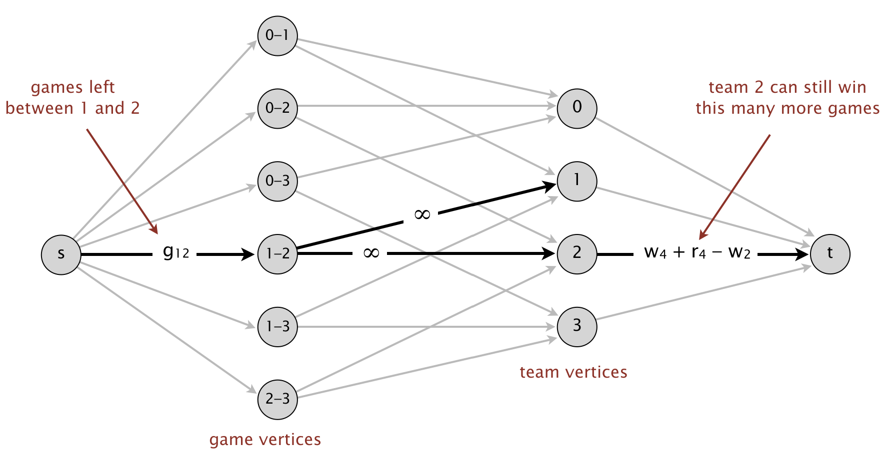

# Baseball Elimination

[Full Project Specification](https://coursera.cs.princeton.edu/algs4/assignments/baseball/specification.php)

### Overview
The Baseball Elimination Problem determines which teams in a sports division are mathematically eliminated from winning their division based on their current standings, remaining games, and the remaining schedule of matches. The project uses a combination of trivial checks and network flow analysis to solve the problem.

### Types of Elimination
- Trivial Elimination: If the maximum number of wins a team x can achieve (games won + games remaining) is less than the current wins of another team i, then team x is trivially eliminated.
- Non-trivial Elimination: If trivial elimination is not applicable, a **max-flow/min-cut algorithm** is used to determine if the team is eliminated. This method models the problem as a flow network to analyze possible outcomes of remaining games.

### Classes
- `BaseballElimination`: represents a sports division and determines which teams are mathematically eliminated.
- `FordFulkerson`: separate implementation of the Ford-Fulkerson algorithm used to compute the max flow in `BaseballElimination`.

### Usage
- Running `BaseballElimination`.
    ```bash 
    $ java -cp ".;..\algs4.jar" BaseballElimination <test_file>
    ```
- Example:
    ```bash
    $ java -cp ".;..\algs4.jar" BaseballElimination tests/teams54.txt
    Team0 is not eliminated
    Team1 is not eliminated
    Team2 is not eliminated
    Team3 is eliminated by the subset R = { Team36 Team33 Team34 Team41 }
    ...
    ```
    Where `R = { Team36 Team33 Team34 Team41 }` is the subset of teams responsible for eliminating `Team3`.

### Input File
- Format:
    ```
    <number of teams>
    <team, i> <wins, w[i]> <losses, l[i]> <remaining_games, r[i]> <games_remaining_against_each_team_j, g[i][j]>
    ...
    ```
- Example:
    ```
    4
    Atlanta       83 71 8 0 1 6 1
    Philadelphia  80 79 3 1 0 0 2
    New_York      78 78 6 6 0 0 0
    Montreal      77 82 3 1 2 0 0
    ```

### Maxflow Formulation

- Suppose we want to find if team `x` is non-trivially eliminated.
- Layers:
    1. Source `s`: Connected to game nodes.
    2. Game nodes `i-j`: Represent the remaining games between teams `i` and `j`.
    3. Team nodes `i`: Represent each team except the team being checked for elimination (`x`).
    4. Sink `t`: Connected to team nodes to limit their maximum possible wins.
- Edge Capacities:
    1. s to game node `i-j`: Capacity set to `g[i][j]` (games left between `i` and `j`).
    2. Game node `i-j` to team nodes `i` and `j`: Unlimited capacity.
    3. Team node `i` to `t`: Capacity set to `w[x] + r[x] - w[i]` (Maximum no. of games team `i` can win before team `x` is eliminated).
- **If max flow from `s` to `t` does not saturate all edges from `s`, team `x` is eliminated by a subset of teams forming a cut.**

### Performance: 
- Memory Usage:
    - The flow network has O(n^2) vertices (teams and games) and O(n^2) edges.
- Time Complexity:
    - Constructing the flow network: O(n^2).
    - Solving the max-flow problem: O(V * E^2), where V = O(n^2) and E = O(n^2).
    - Total worst-case time complexity: O(n^5).


