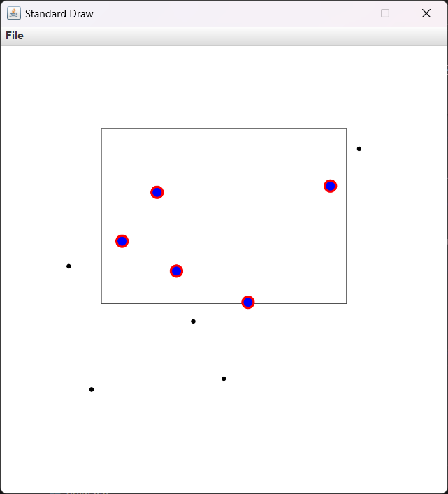

# KD-trees

[Full Project Specification](https://coursera.cs.princeton.edu/algs4/assignments/kdtree/specification.php)

# Overview
This project implements a 2D-Tree data structure for efficient geometric searches in the unit square 
It supports:
- Range Search: Finding all points within a given rectangle.
- Nearest Neighbor Search: Finding the closest point to a query point.

### Data Structures
1. Brute-Force Implementation: `PointSET`
    - Uses a TreeSet to store points.
    - Insertion: $O(\log{n})$, Range and nearest neighbor search: $O(n)$
2. Optimized Implementation: `KdTree`
    - A 2D-Tree that recursively splits the space using alternating x and y coordinates.
    - Insertion: $O(\log{n})$, Range and nearest neighbor search: $O(\sqrt{n})$ in the average case
3. Separate Implementation of left leaning red-black tree: `LLRB`
    - Supports insertion, deletion, and search in $O(\log{n})$ time

### Interactive Clients
- `KdTreeVisualizer`: Allows users to build a 2D-Tree by clicking on points.
- `RangeSearchVisualizer`: Visualizes range search by dragging rectangles.
- `NearestNeighborVisualizer`: Shows nearest neighbor results interactively.

### Usage
1. Running `KdTreeVisualizer`.
    ```bash
    $ java -cp ".;..\algs4.jar" KdTreeVisualizer
    ```
2. Running `RangeSearchVisualizer`.
    ```bash
    $ java -cp ".;..\algs4.jar" RangeSearchVisualizer [path/to/test/file.txt]
    ```
3. Running `NearestNeighborVisualizer`.
    ```bash
    $ java -cp ".;..\algs4.jar" NearestNeighborVisualizer [path/to/test/file.txt]
    ```

### Example
    ```bash
    $ java -cp ".;..\algs4.jar" RangeSearchVisualizer tests/input10.txt
    ```


### Input File Format
- Each line in the file specifies the coordinates of a single point using the following format:
    ```
    x-coordinate y-coordinate
    ```
- Each point must be contained within the unit square $[0, 1]\times[0, 1]$