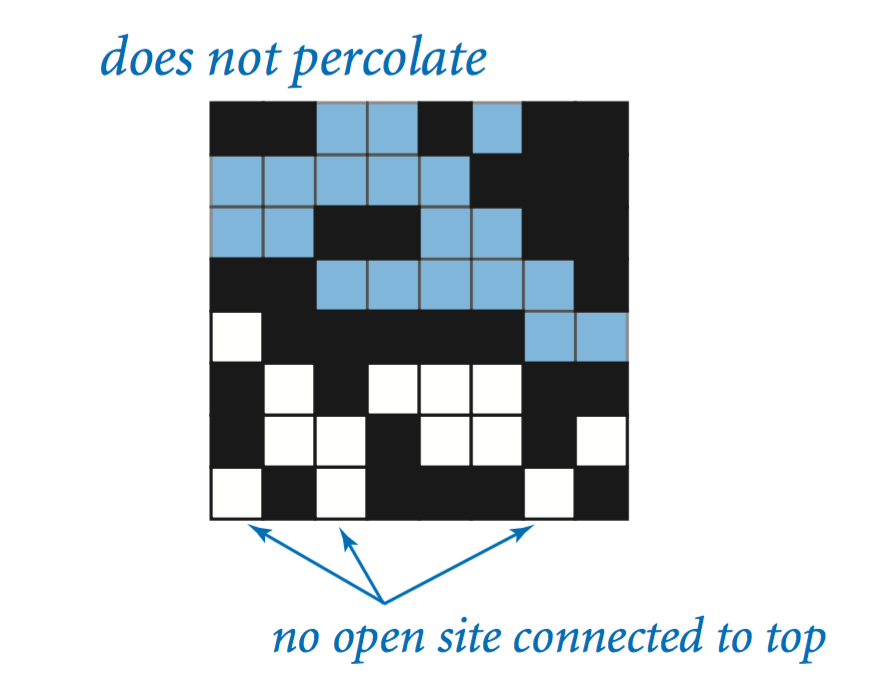

# Percolation Simulation

[Full Project Specification](https://coursera.cs.princeton.edu/algs4/assignments/percolation/specification.php)

### Overview
This project implements a Percolation system simulation using an n x n grid model. The goal is to estimate the percolation threshold. This model applies to scenarios like the flow of liquids through porous materials or electrical conductivity in composite materials.

### Percolation Model
The grid consists of blocked and open sites. A system "percolates" if any open site on the bottom row is connected to the top row via adjacent open sites (up, down, left, or right), creating a path across the grid.

### Percolation threshold
When n is sufficiently large, there is a percolation threshold value p* such that when site vacancy probability p < p* a random n-by-n grid almost never percolates, and when p > p*, a random n-by-n grid almost always percolates. 

 

### Key Classes
- Percolation - Models the grid and provides methods to:
    - Open sites.
    - Check if a site is open or full.
    - Determine if the system percolates.
    - Keep track of the number of open sites.
##### The Percolation class uses Weighted Quick Union-Find (from WeightedQuickUnionUF in algs4.jar) to efficiently connect open sites and check for percolation. Worst case time complexity of each find opeation is log(N), where N is the number of cells in the grid i.e. n^2

- PercolationStats - Conducts a Monte Carlo simulation to estimate the percolation threshold:
    - Initializes blocked sites.
    - Opens random sites until the system percolates.
    - Calculates the fraction of open sites for multiple trials and computes the mean, standard deviation, and 95% confidence interval of the threshold.

- UF - Separate implementation of weighted quick union find with path compression. This brings the worst case time complexity of each find opeation to log*(N).

### Usage
Run the program with the following command
    ```bash
    $ java -cp ".;..\algs4.jar" PercolationStats [grid size (n)] [number of trials (T)]
    ```

### Example
    ```bash
    $ java -cp ".;..\algs4.jar" PercolationStats 20 1000
    mean = 0.5911775000000005
    stddev = 0.04579934304740158
    95% confidence interval = [0.5883388273083644, 0.5940161726916365]
    ```

### Performance
- The constructor for Percolation has a time complexity of n².
- All other methods take constant time plus a constant number of union/find operations.